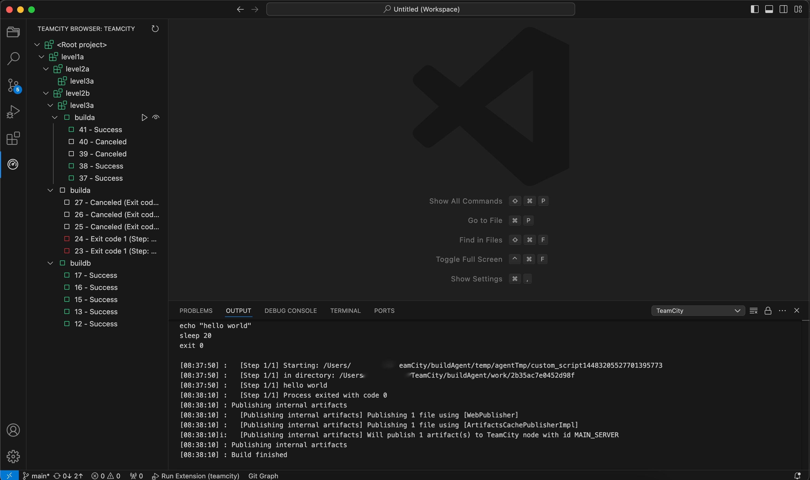

# Teamcity Extension for VSCode

This extension was written when I didnt find a simple integration for TeamCity into VSCode. It's not
fancy, it's still very much a work in progress, but it's servicable. 

## Features
* Treeview of server projects, build configurations and last 5 runs (filtered by access rights)
* Ability to trigger build run
* Ability to enter prompt parameters for parameterised builds
* Build state indication (Success / Failure / Queued / Running / Canceled)
* Build status text displayed on build runs
* Live status updates while build is running or queued
* Ability to request build log (displayed in OUTPUT window)
